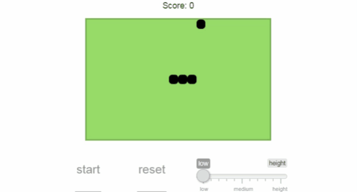

Here you can find my own implementation of <i>Snake</i> in R/Shiny with css and java script.

How play
--------

-   set level
-   start game - click play or use arrows
-   move snake using arrows

When you lose you will see your score and position.

Enjoy :)
